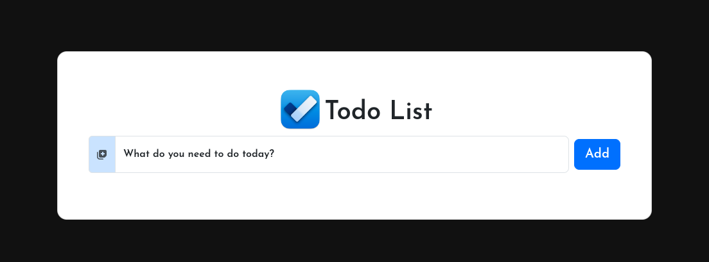

<p align="center">
  <a href="https://iti.gov.eg/" target="_blank" rel="noopener noreferrer">
    
  </a>
</p>

<div align="center">

# To-Do List Website
This is a simple website for Information Technology Institute -> (ICC)
using a node.js and bootsrap etc... 

## Screenshots



</div>

## Usage
- **Linux:**
```bash
git clone https://github.com/TarekHesham/To-Do-List.git
cd To-Do-List
npm install
npm run dev
```

- **Windows:**
```bash
npm install
npm run dev
```

## Docs

- https://nodejs.org/api/http.html
- https://www.npmjs.com/package/nodemon
- https://getbootstrap.com/docs/5.0/
